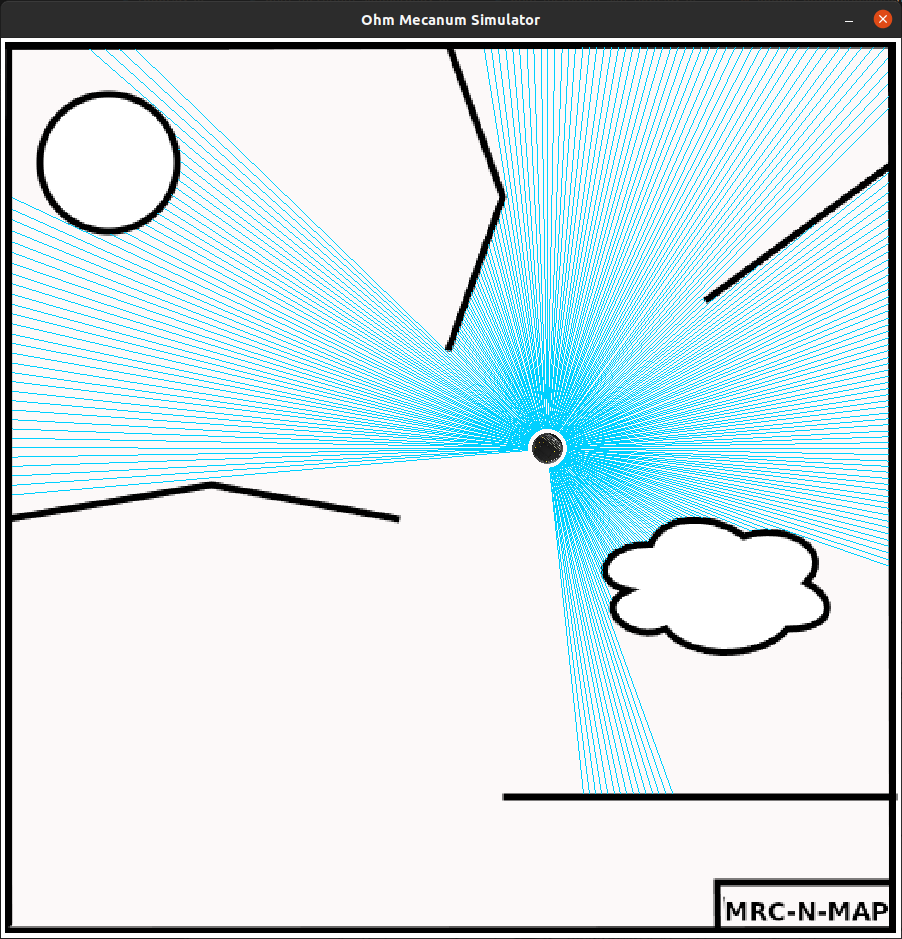
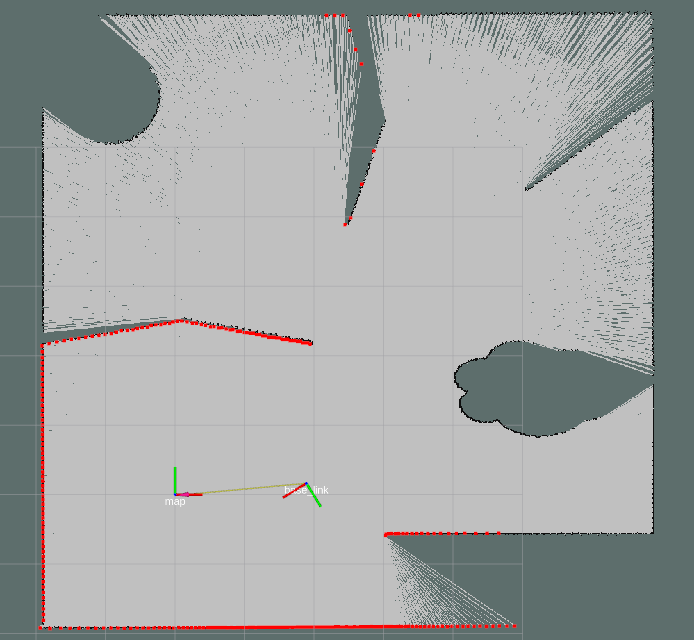
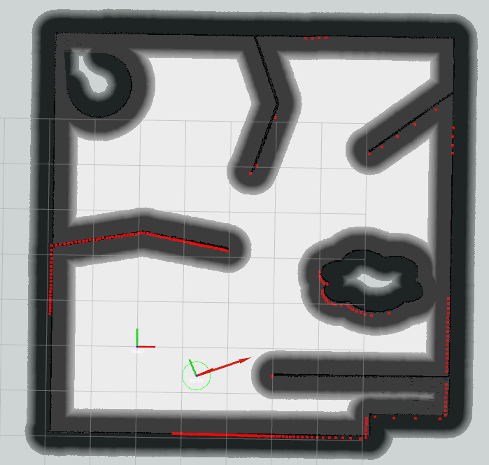
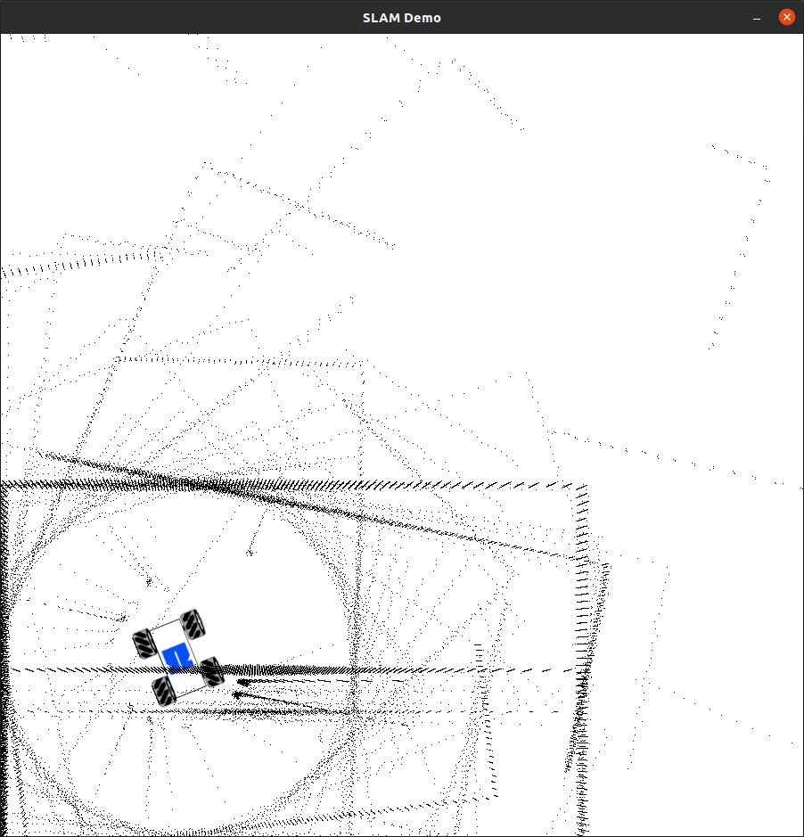

# ohm_mecanum_sim
This package comprises a pygame-based robot simulation for mecanum-driven kinematic concepts and is extended for kobuki robot.





<!--  -->

## Ubuntu 20.04
```
sudo apt install python3-pip
pip install pygame
```
## Ubuntu 18.04
Tests have been performed with ROS melodic, albeit the used python versions differ. While ROS melodic uses python2.x, the simulator need python3. The  reason is, that ROS noetic will require python3. In order to make the simulator work with ROS melodic, you can follow the installation hints below.

### Prerequisites on Ubuntu 18.04
Installing python3 aside python2 can be done with pip:
```console
user@machine:~$ sudo apt install python3 python-pip python3-pip python-catkin-tools
user@machine:~$ sudo update-alternatives --install /usr/bin/python python /usr/bin/python2.7 1
user@machine:~$ sudo update-alternatives --install /usr/bin/python python /usr/bin/python3.6 2
user@machine:~$ pip install -U defusedxml rospkg pygame pycryptodomex gnupg pyside2 pydot numpy
```

## Starting the simulator
Go to your catkin workspace / execute the following commands (replace the path to your catkin workspace accordingly):
```console
user@machine:~$ roscore &
user@machine:~$ cd workspace/catkin_ws
user@machine:~/workspace/catkin_ws$ catkin_make
user@machine:~/workspace/catkin_ws$ source devel/setup.bash
user@machine:~/workspace/catkin_ws$ python3 src/ohm_mecanum_sim/scripts/ohm_mecanum_sim_node.py
```

## Moving around the robots
One can use different tools to move the robot. An example of these is to use teleop_twist_keyboard [teleop_twist_keyboard](https://wiki.ros.org/teleop_twist_keyboard):
```
rosrun teleop_twist_keyboard teleop_twist_keyboard.py cmd_vel:=/robot1/cmd_vel
```
# Mapping
Using [Gmapping](https://wiki.ros.org/gmapping) to map the world:
```
roslaunch ohm_mecanum_sim kobuki_gmapping.launch
```
# Navigation
Using [Move Base](https://wiki.ros.org/move_base) to navigate the robot and [AMCL](https://wiki.ros.org/amcl) to localize the robot on the map:
```
roslaunch ohm_mecanum_sim kobuki_navigation.launch
```